# Understanding-Traffic-Light-Signal-for-Intersection-Task
Part of a project for autonomous vehicle competition for college students (2023 미래형자동차 자율주행 SW 경진대회)

<br>
<br>

## Introduction
Imagine we are driving a car. When we face an intersection that we are about to pass through, we check where is the traffic light and judge if we can go or not. To automate this procedure as a self-driving car, (1)it should detect the traffic light(object detection task) and also (2)decode the traffic light image to make a vehicle control. I first referred to the repo: [[1]](#references) [Traffic-Light-Detection-And-Color-Recognition](https://github.com/nileshchopda/Traffic-Light-Detection-And-Color-Recognition). In this repository, he proposed a 2 step approach that (1)Tensorflow's fastRCNN performs an object detection task and (2)image processing using a HSV color mask.

The proposed method showed good performance, but I found two areas for improvement. First, fastRCNN is itself a two-step algorithm, so using a one-step algorithm like YOLO could be more advantageous for real-time traffic light detection. Second, the existing method checks if all pixels in the bbox of the traffic light are within the red and yellow mask, which can lead to misclassification of traffic light signal, as in the output_10 image, where a yellow traffic light cover is misclassified as a stop sign.


Therefore, in my approach, I used [[2]](#references)[YOLOv8](https://github.com/ultralytics/ultralytics) (the latest model of YOLO, which is most widely used in practical object detection) for object detection task, and I selected the circular panel part where the light comes out from the traffic light as the region of interest for red and yellow masking and performed color recognition.

<br>
<br>

## How to get started
### Requirements
- [ROS noetic](http://wiki.ros.org/noetic/Installation/Ubuntu)
- [ROS usb-cam package](https://github.com/ros-drivers/usb_cam)
- [PyTorch](https://pytorch.org/get-started/locally/)
- [YOLO](https://github.com/ultralytics/ultralytics)

<br>

### Installation

1. Clone this repository and move it to your own workspace.
```bash
git clone git@github.com:thisisWooyeol/Understanding-Traffic-Light-Signal-for-Intersection-Task.git
mv Understanding-Traffic-Light-Signal-for-Intersection-Task  YOUR-OWN-WS-PATH/src/
```

2. Move `usb_cam.yml` file to your `usb-cam/config/` folder and update your workspace.
```bash
# Note that cloned usb-cam package should be also placed in your own workspace folder
mv Understanding-Traffic-Light-Signal-for-Intersection-Task/usb_cam.yml usb-cam/config
source YOUR-OWN-WS-PATH/devel/setup.sh
```

<br>

### If you want to finetune YOLO

1. Gather your custom images and its bbox label(.txt file) and split them into train and validation sets.

2. Edit the path for train and validation sets in `src/utils/data.yaml`.

3. run `tuning_yolo.py`.

<br>

### Run traffic light decoder

With your usb camera connected, run the `traffic_node` with launchfile
```bash
roslaunch traffic-light-task TL_decoder-test.launch
```

<br>
<br>

## Key idea for color recognition task

### Summary
1. Using Canny Edge Detection, detect the edge of all components in the image.
2. Using Hough Transform, detect the circle (traffic light) in the image.
3. Fill the circle with white color to make the circle as a mask.
4. Apply the mask to the original image.
5. Apply the red, yellow mask to the masked image.
6. Compare the percentage of red, yellow values in the masked image. <br>
   If the percentage of red, yellow values is greater than the threshold, then return True

<br>

### With implemented codes

**1. Canny Edge Detection**
```python
# ! img_edge : single channel image
img_edge = cv2.Canny(crop_img, 100, 200)
img_edge = cv2.morphologyEx(img_edge, cv2.MORPH_CLOSE, (3, 3))
```
In addition to canny edge detection, I used morphological closing to make the edges connect to each other.

<br>

**2. Extract circle with Hough Transform**
```python
circles = cv2.HoughCircles(img_edge, cv2.HOUGH_GRADIENT,
                           dp=1, minDist=20, param1=50, param2=20, minRadius=0, maxRadius=100)
circles = np.uint16(np.around(circles))  # shape=(1, N, 3), dtype=uint16
```
Extract circles from grayscale edge image to make a ROI of traffic light panel.

<br>

**3. Fill the circle with white**
```python
roi_circle = np.zeros_like(crop_img[:, :, 0])  # black grayscale background
for circle in circles[0]:  # circles[0].shape=(N, 3), N : number of circles
   center, radian = circle[:2], circle[2]
   cv2.circle(roi_circle, center, radian, 255, -1)
```

<br>

**4. Apply circle mask to the original image (traffic light bbox)**
```python
circle_masked_img = cv2.bitwise_and(crop_img, crop_img, mask=roi_circle)
```

<br>

**5. Apply the red, yellow mask to the masked image**
```python
#  after applying mask to the image, use Morphological Opening to remove noise
circle_masked_img_hsv = cv2.cvtColor(circle_masked_img, cv2.COLOR_BGR2HSV)  # ! convert to HSV color space
red_yellow_roi = self.get_red_yellow_roi(circle_masked_img_hsv)
red_yellow_img = cv2.bitwise_and(crop_img, crop_img, mask=red_yellow_roi)
red_yellow_img = cv2.morphologyEx(red_yellow_img, cv2.MORPH_OPEN, (3, 3), iterations=1)
```
The function `self.get_red_yellow_roi(img)` makes color mask of red and yellow with custom HSV color range.

<br>

**6. Compare the percentage of red values**
```python
rate = np.count_nonzero(red_yellow_img) / (crop_img.shape[0] * crop_img.shape[1])
```
If red and yellow pixel rate in cropped traffic light image exceeds certain threshold, we can judge it's time to stop.

<br>
<br>

## Results

### Results for red light images
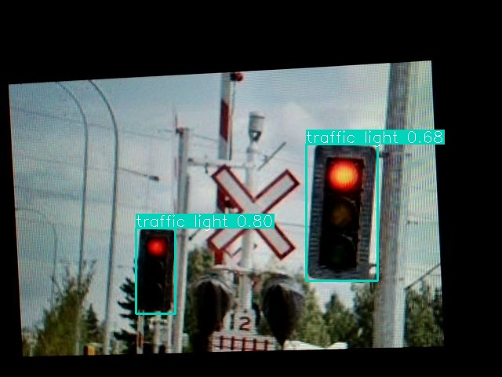 |
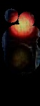 | 
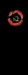

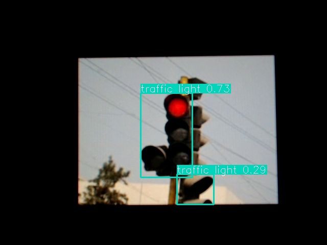 |
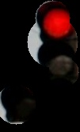 |
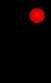

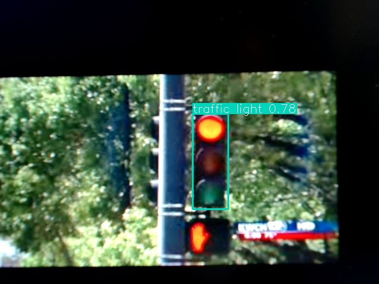 |
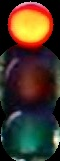 |


<br>

### Results for green light images
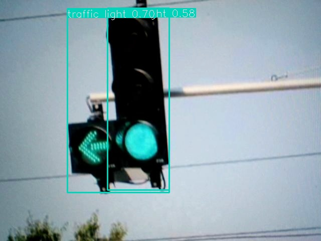 |
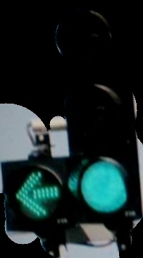 |
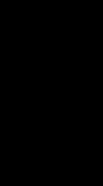

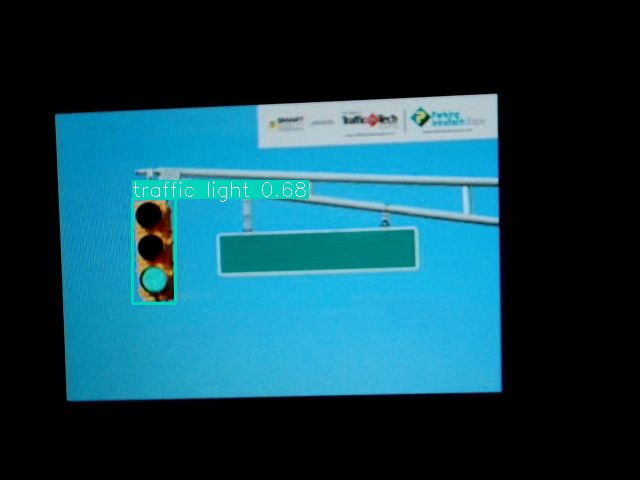 |
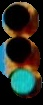 |
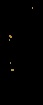

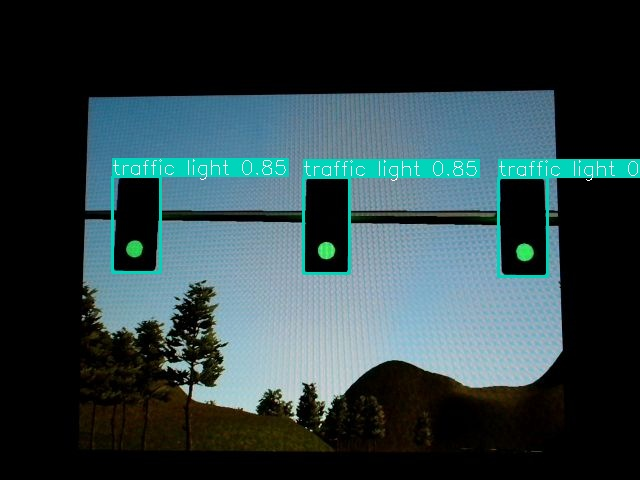 |
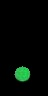 |


<br>
<br>

## Self-driving mini car demo


In addition to traffic light decoder module, I used crosswalk information to determine **"when to stop"**. With custom crosswalk images I trained YOLO to detect crosswalk(you can see crosswalk has label 0 in `src/utils/data.yaml`). The `crosswalk_detection` node in `crosswalk_detection_node.py` calculates how close the crosswalk is by using center y-coordinate of crosswalk bbox. If traffic light signal is red or yellow and y-coordinate of crosswalk is big enough(if crosswalk is close enough to the car), the car stop at that time. You can run the `crosswalk_detection` node with `traffic_node` and `yolo_node` by `TL4Intersection.launch` file.

The video is 3x speed demo of traffic light task in real world mini car. We used logitech C920 webcam for object detection and Arduino for controlling mini car hardware. Notebook specs are i7 11th gen, NVIDIA 3060, 32 GB RAM. 

<br>
<br>

## Limitations
As color recognition is performed with manually designed image processing, the performance of color recognition can be brittle to hyperparameters. It also causes versatility-accuracy trade-off.
Also, it can only distinguish the color of traffic light, not some other signals such as turn left or turn right. To handle these problems, training the traffic light images of each color separately may help.
In this procedure, automatically distinguish the color of traffic light with this code can make the labeling procedure easier.

<br>
<br>

## References
[1] [Traffic-Light-Detection-And-Color-Recognition](https://github.com/nileshchopda/Traffic-Light-Detection-And-Color-Recognition) \
[2] [YOLOv8 Github](https://github.com/ultralytics/ultralytics) \
[3] [OpenCV Documentation](https://opencv-python.readthedocs.io/en/latest/)